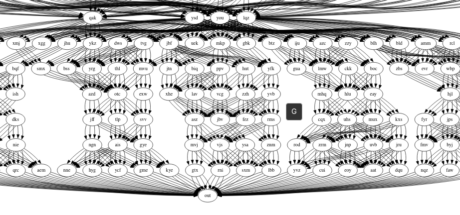
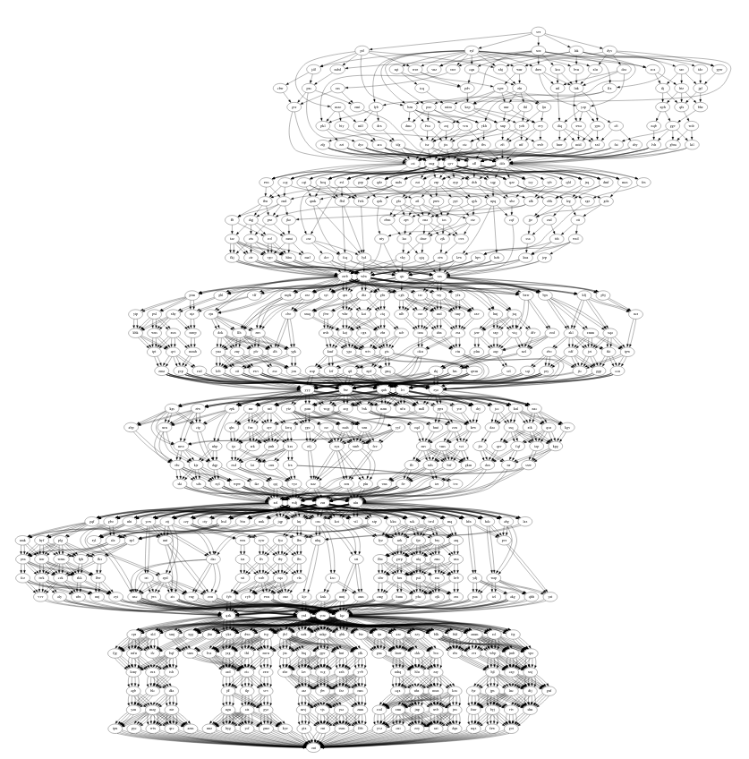

# Collection of solutions for Advent of Code 2025
This year I decided to make the solutions in Rust. The biggest challenge will probably be getting used to the syntax and using Rust on Linux (just getting started here as well).

How to run (and compile these): Since it is not allowed to share your inputs (for reverse engineering), I place them inside folder hidden by gitignore: dayX/input/dayX.txt. These are included using include_str! so to run it, the file has to be present on the disk.

## Day 1
This is a simple exercise for circular buffer. For part 1 just checking if there is a `zero` in the sequence is enough. But for part 2, you need to check all overflows.

The naive solution would be implementing it step by step and each step check if we are at 0. Perfectly doable for the size of the input. Instead though, we can get how many revolutions we did and then use the remainder to move (and again check if cross the boundary).

## Day 2
Here we have to find sequences in a number. For the first part it's easy - to be a duplicated sequence, it needs even number of digits. To get digits from a decimal number, we can just divide it by 10 till we hit 0. Then modulo to get one part and divide to get the second. Compare and if equals, that is a sequence.

The part 2 is similar, but we have to find all occurences. Aha! So this is recursive. We don't split in middle but try to find the pattern. For me the biggest gotcha was even number, because for example 1_001_001 was getting matched. I only needed to check the remaining length to match the pattern (here it's 001).

## Day 3
Part 1 was about finding two largest numbers. The order might be an issue, so we can find the largest and if it's at the very end (like 8119) then take the first second largest number.

So here for part 2 I decided to get smart. That was a bad decision. If you wanna get smart with these tasks, make sure to handle all edge cases in your algorithm. That wasn't the case, so just use memoization and brute force it. Which works on test data, but is slow for input data...

Turns out, that sorting it lexicographicly (linear time) is the correct solution here. So you basically go over the values in order, and if you encounter bigger value then the last one, try to propagate it (if using stack, then it's popping the stack) until the value in front is not bigger and if we have enough remaining values.

## Day 4
This task was very simple and perfectly illustrates all the tasks I have done up till now: The first part usually creates a sub-function that can be used to resolve the part 2 (not always the case for me), but here it really shines. Very straightforward.

## Day 5
I see the task and immediatelly suspect, that for part 2, I'll need to merge the intervals. Let's see how it goes...

If we skip the issues between rust having string with \n and windows text file with \r\n, here we go! merge intervals!

## Day 6
This one was very simple. You just have to parse the data properly. The parsing here is the problem though: Inspecting chars/strings in VS Code when using rust proved to be hard. I am way too spoiled from PowerShell or C# and Visual Studio... Maybe there is a way?

## Day 7
So when I first see this, my question is: Can I have two splitters next to each other? No I don't which makes things easier.

There is no issue here. I rewrote the part1 for part2 to use recursion instead so that I can use memoization.

## Day 8
At first, I though this will be minimum spanning tree, but getting all triplets (i, j, distance) where 'i' is index of first box and 'j' is index of second box, sorting them by distance and then do union-tree-like algorithm based on distance worked. In fact, here part 2 might have been easier as it skipped the part, where you have to get the largest sets.

## Day 9
I felt like the part 1 will be easy and it was. Just make an iterator for cartesian product of indices and compare all bounding boxes and get the largest one. But part 2... 

So my intuition tells me, I get a non-convex polygon and for each pair of the cartesian product I could check if the bounding box is inside this polygon. That should be that none of the bounding box edges cross the edge of the polygon and at the same time, all corners of the bounding box are inside the polygon.

And it ended as I though, it works for test case, but there is some edge case in input data... Surprisingly, debugging with AI helped. It identified the edge cases I mishandled. It feels wrong, but the overall algorithm is mine, and it has been a long time since I actually implement line-segment intersection myself.

## Day 10
I wanted to be smart for part 1, but ended with brute force: Find all combinations of buttons for 1, 2, 3, etc. and apply them. Take the first find. Since we can efficiently do the buttons and lights by XOR, it was fine.

But part 2, I've implemented memoization and dfs. Of course, it's too slow and crashes eventually on memory. Maybe I need to exploit existence of some loops and repetitions?

Well... technically speaking, it's a set of equations. For example, if I take this `[.##.] (3) (1,3) (2) (2,3) (0,2) (0,1) {3,5,4,7}` we get `(0 0 0 1) * x + (0 1 0 1) * y + (1 0 1 0) * z + (1 1 0 0) * w = (3 5 4 7)`:
1. 0 0 0 1 | 3
1. 0 1 0 1 | 5
1. 1 0 1 0 | 4
1. 1 1 0 0 | 7

Ok, I've tried to make ILP out of it. It is fairly simple Ax = b where xi >= 0. Sounds simple right? Well, I haven't written single optimizer in my live and last time I did this was at uni. Few AI suggestions later and optimization for BFS and DFS, I went for the z3 solver (python package). If you look at `solution.py` what it does is self explanatory.

## Day 11
I looked at the test input data and there was no cycle. So I took a leap of faith and part 1 was done with simple BFS! 

I also checked, if there is some output from `out` and there is not, another step less to handle. I tried the same strategy but as expected, there is a catch. I've plotted the result in Graphviz and guess what I saw?

The small subset? Multiply it by 4 and that's where the `srv` lies. Good thing is, I don't see any cycles, so it really is just the sheer amount.

Now do you see those groups of nodes between the large nodes? Well we don't have to search them all, we can split them. We can see from the graph that all is funnelling into them so we compute a subset and multiply the results.

## Day 12
Well this was a roller coaster of emotions. I made first implementation, didn't work (it said all the solutions are valid). I've plotted the results and of cource it won't work! It wasn't doing anything... I am starting to dislike debugging in VS Code with Rust.

After a game session I came back, scrapped the solution and made a new one. I'd say big brain decision from me to include a check if we even can fit all the `#` from requested presents in the regions. It is slow, but it works and it rejected almost half outright!

I was quite scared seeing how slow it is, how will I finish part 2? But there was no part 2! Well then, Happy Christmas \o/

PS: I went back and checked the implementation, I can add additional check if the solution is found during search phase; now it's fast.